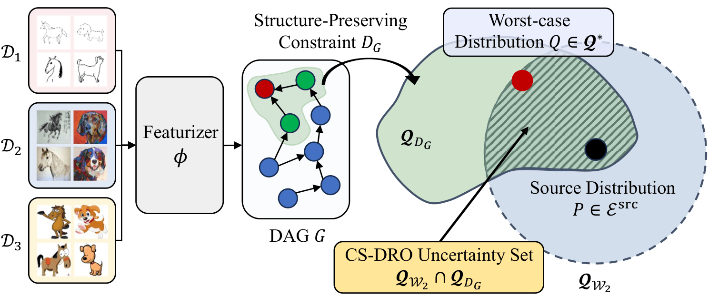

<h1 align="center">
  Causal Structure-guided Distributionally Robust Optimization under Domain Shifts
</h1>

<p align="center">
  ✨ <a href="https://kdd2026.kdd.org/"><strong>KDD 2026</strong></a> ✨
</p>

<p align="center">
  <strong>Seonggyeom Kim<sup>†</sup> · Eunjung Choi<sup>†</sup> · Dong-Kyu Chae<sup>*</sup></strong>
  <br>
  <a href="https://dilab.hanyang.ac.kr/">Data Intelligence Lab</a>, Hanyang University
  <br>
  <sup>†</sup>Equal contribution &nbsp;&nbsp; <sup>*</sup>Corresponding author
  <br><br>
  <a href="CS-DRO.pdf"><strong>Main Paper</strong></a> ·
  <a href="Supplementary_Material.pdf"><strong>Supplementary Material</strong></a> ·
  <strong>Poster (TBD)</strong>
</p>

## 💡 CS-DRO Framework


CS-DRO is a domain generalization framework that integrates learned causal structure into distributionally robust optimization for reliable prediction under unseen domain shifts.

CS-DRO first maps samples from multiple source domains into a latent representation and learns a DAG over the resulting features. The learned structure determines causally relevant feature masks and constrains the adversarial inner maximization. The model is then optimized against worst-case feature distributions while regularizing prediction consistency and structural preservation.

<p align="center">
  
</p>

<p align="center">
  <sub><b>Figure 1.</b> CS-DRO constructs an uncertainty set from a Wasserstein neighborhood and a causal structure-preserving constraint.</sub>
</p>

For detailed derivations, proofs, additional experimental results, and extended analyses, see the [supplementary material](Supplementary_Material.pdf).

## 📊 Benchmarks

The provided training pipeline evaluates all target domains through leave-one-domain-out validation. The reference configurations cover:

| Dataset        | Domains                                   | Feature dimension | `lambda_G` | `kappa` |
| -------------- | ----------------------------------------- | ----------------: | -----------: | --------: |
| PACS           | Art painting, Cartoon, Photo, Sketch      |           `256` |       `10` |   `1.0` |
| VLCS           | Caltech101, LabelMe, SUN09, VOC2007       |           `512` |       `10` |   `1.0` |
| OfficeHome     | Art, Clipart, Product, Real World         |           `512` |        `1` | `0.001` |
| TerraIncognita | Camera-trap locations L100, L38, L43, L46 |           `512` |      `0.1` |  `10.0` |

## 📈 Evaluation

The table below reports leave-one-domain-out average accuracy (%) over three runs with different random seeds. The best result on each dataset is shown in **bold**.

| Method | PACS | VLCS | OfficeHome | TerraIncognita | Avg. |
| ------ | ---: | ---: | ---------: | -------------: | ---: |
| GroupDRO | 84.4 | 76.7 | 66.0 | 43.2 | 67.6 |
| SAL | 86.1 | 78.0 | 71.4 | 52.2 | 71.9 |
| DR-DG | 87.5 | 78.9 | 70.7 | 50.4 | 71.9 |
| GLOT-DR | 86.6 | 78.1 | 71.9 | 50.2 | 71.7 |
| TRO | 86.8 | 77.4 | 71.5 | 51.3 | 71.8 |
| SRM | 87.1 | 79.9 | 71.0 | 49.5 | 71.9 |
| MEDRO | 87.0 | 79.6 | 70.0 | 49.2 | 71.5 |
| SR-WDRO | 86.4 | 79.1 | 71.1 | 50.7 | 71.8 |
| **CS-DRO** | **88.9** | **80.8** | **73.4** | **54.1** | **74.3** |

## ⚙️ Environment Setup

The main experiments were conducted on a single NVIDIA GeForce RTX 3090 GPU with the following environment:

```text
Python:      3.10.18
PyTorch:     2.4.0+cu118
Torchvision: 0.19.0+cu118
CUDA:        11.8
cuDNN:       9.0.1
```

Clone the repository and install the dependencies:

```bash
git clone https://github.com/Sinegi/CS-DRO.git
cd CS-DRO

pip install -r requirements.txt
```


## 🚀 Quick Start

### 1. Download the datasets

The download script prepares the supported DomainBed datasets under the specified data directory. The reference CS-DRO experiments use VLCS, PACS, OfficeHome, and TerraIncognita.

```bash
python -m domainbed.scripts.download --data_dir ./dataset
```

### 2. Run a PACS experiment

The following command trains CS-DRO for every PACS target domain and reports the leave-one-domain-out results:

```bash
python train_all.py PACS0 \
  --algorithm CS_DRO \
  --data_dir ./dataset \
  --dataset PACS \
  --holdout_fraction 0.2 \
  --output_dir train_output/pacs \
  --seed 0 \
  --lambda_r 1.0 \
  --lambda_G 10 \
  --kappa 1.0 \
  --hp_tau 10.0 \
  --trial_seed 0 \
  --hparams '{"hidden_size": 256, "out_dim": 256, "checkpoint_freq": 200, "steps": 5000}'
```

If `--test_envs` is omitted, `train_all.py` evaluates each domain in turn. To evaluate only selected target-domain indices, pass one or more indices, for example `--test_envs 0 2`.

Training logs and summaries are written below:

```text
<output_dir>/<dataset>/<timestamp>_<run_name>/
```

### 3. Configure the other benchmarks

Reference hyperparameters for all four benchmarks are provided in `launch_train.sh`. Copy the command for the desired dataset and run it with the registered algorithm name `CS_DRO` (with an underscore).

The benchmark-specific values for `out_dim`, `lambda_G`, and `kappa` are also summarized in the Benchmarks table above.

## Main Arguments

### Experiment

| Argument               | Description                                          |           Default |
| ---------------------- | ---------------------------------------------------- | ----------------: |
| `name`               | Positional run name used in the output directory     |          Required |
| `--data_dir`         | Root directory containing the datasets               |      `datadir/` |
| `--dataset`          | DomainBed dataset name                               |          `PACS` |
| `--algorithm`        | Training algorithm; use`CS_DRO` for this method    |           `ERM` |
| `--output_dir`       | Root directory for logs and checkpoints              |  `train_output` |
| `--test_envs`        | Target-domain indices; all domains when omitted      |               All |
| `--seed`             | Global random seed                                   |             `0` |
| `--trial_seed`       | Seed used for data splits and random hyperparameters |             `0` |
| `--holdout_fraction` | Fraction reserved from each training domain          |           `0.2` |
| `--steps`            | Number of optimization steps                         | Dataset-dependent |
| `--checkpoint_freq`  | Evaluation interval in steps                         | Dataset-dependent |

### CS-DRO

| Argument          | Description                                         | Reference default |
| ----------------- | --------------------------------------------------- | ----------------: |
| `--lambda_r`    | Weight for clean/adversarial prediction consistency |           `1.0` |
| `--lambda_G`    | Weight for the structure-preserving constraint      |           `1.0` |
| `--kappa`       | Constraint threshold used by the adversarial update |           `1.0` |
| `--hp_tau`      | Temperature for the consistency distributions       |          `10.0` |
| `--hidden_size` | Hidden dimension of the light encoder               |           `512` |
| `--out_dim`     | Latent representation dimension                     |           `512` |

Additional hyperparameters can be supplied as JSON through `--hparams` or as command-line overrides. Configuration precedence is:

```text
DomainBed defaults → config.yaml → additional YAML files → command-line arguments
```

## Citation

If you find this work useful, please cite:

```bibtex
@inproceedings{kim2026causal,
  title     = {Causal Structure-guided Distributionally Robust Optimization
               under Domain Shifts},
  author    = {Kim, Seonggyeom and Choi, Eunjung and Chae, Dong-Kyu},
  booktitle = {Proceedings of the 32nd ACM SIGKDD Conference on
               Knowledge Discovery and Data Mining},
  year      = {2026}
}
```

## Acknowledgements

This implementation builds on [DomainBed](https://github.com/facebookresearch/DomainBed), [SWAD](https://github.com/khanrc/swad), and [iDAG](https://github.com/lccurious/iDAG). The main CS-DRO changes are located in:

- `domainbed/algorithms/algorithms.py`
- `domainbed/networks.py`
- `domainbed/trainer.py`

## License

This project is released under the [MIT License](LICENSE). Third-party components retain their respective licenses.
